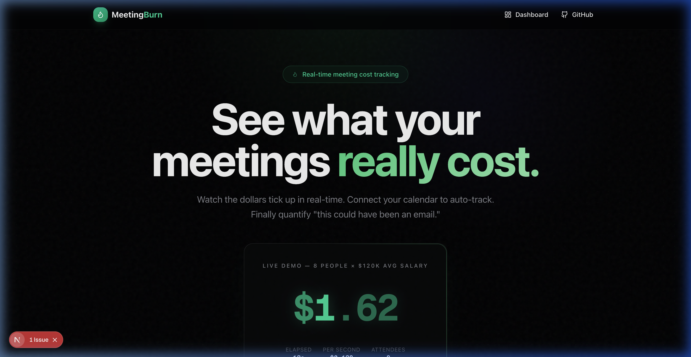

# 🔥 MeetingBurn

**See what your meetings really cost — in real-time.**

[](https://meetingburn-tau.vercel.app)
[](https://github.com/iamgagan/meetingburn)

> Built for the **48-Hour Vibe Coding Challenge** by **Team KashMoney**

🌐 **Live Demo:** [https://meetingburn-tau.vercel.app](https://meetingburn-tau.vercel.app)

---

## What is MeetingBurn?

A real-time meeting cost calculator that shows teams the true dollar cost of their meetings — live, as they happen. Enter the number of attendees and their average salary, start the timer, and watch the money tick up every second.



## Features

- 🔥 **Real-time Cost Ticker** — Live-updating dollar counter with severity-based color coding (green → yellow → red)
- 📅 **Google Calendar Sync** — Auto-import meetings with attendee counts for effortless tracking
- 📊 **Meeting History & Analytics** — Weekly cost trends, sortable tables, and CSV export
- 🔗 **Shareable Reports** — Public links showing meeting cost breakdowns
- 👥 **Salary Presets** — Role-based salaries (Engineer, PM, Designer) for accurate calculations
- 🔐 **Google OAuth** — Sign in with Google using NextAuth.js

## Tech Stack

| Layer | Technology |
|---|---|
| Framework | Next.js 16 (App Router) + TypeScript |
| Styling | TailwindCSS v4 + Shadcn/ui |
| Animations | Framer Motion |
| Charts | Recharts |
| Database | Supabase (PostgreSQL) |
| Auth | NextAuth.js (Google OAuth) |
| Hosting | Vercel |

## Getting Started

```bash
# Clone the repo
git clone https://github.com/iamgagan/meetingburn.git
cd meetingburn

# Install dependencies
npm install

# Set up environment variables
cp .env.example .env.local
# Fill in your Supabase and Google OAuth credentials

# Run the dev server
npm run dev
```

Open [http://localhost:3000](http://localhost:3000) to see MeetingBurn in action.

## Environment Variables

| Variable | Description |
|---|---|
| `NEXT_PUBLIC_SUPABASE_URL` | Supabase project URL |
| `NEXT_PUBLIC_SUPABASE_ANON_KEY` | Supabase anonymous key |
| `SUPABASE_SERVICE_ROLE_KEY` | **(Required)** Admin key for secure server-side operations (safe: never leaks to client via `server-only` isolation) |
| `GOOGLE_CLIENT_ID` | Google OAuth client ID |
| `GOOGLE_CLIENT_SECRET` | Google OAuth client secret |
| `NEXTAUTH_URL` | App URL (http://localhost:3000 for dev) |
| `NEXTAUTH_SECRET` | Random secret for NextAuth.js |

## Route Structure

```
/                          → Landing page with live demo
/signin                    → Google OAuth sign-in
/dashboard                 → Main dashboard with cost tracker
/dashboard/calendar        → Google Calendar sync
/dashboard/history         → Meeting history & analytics
/dashboard/settings        → Salary presets management
/report/[id]               → Shareable meeting report
/api/auth/[...nextauth]    → Auth endpoints
/api/calendar              → Calendar API
/api/meetings              → Meetings CRUD API

---

## 🚀 Judge Verification & Setup

### Supabase Security & Persistence Story
We intentionally use `supabaseAdmin` (Service Role Key) for all API data persistence to gracefully bridge NextAuth and Supabase without strict RLS row blockers.
- **Why?** Passing NextAuth Google sessions directly to Supabase RLS causes friction. Admin clients solve this.
- **Security**: The `SUPABASE_SERVICE_ROLE_KEY` is completely isolated in `lib/supabase-admin.ts` using the React `server-only` package so it **cannot leak to the client**.
- **Data Governance**: Ownership is strictly enforced *server-side* within `/api/meetings` by validating the NextAuth session explicitly before returning or mutating records.
- **Protection**: We employ **Zod schema validation** for payloads and a **Token Bucket Rate Limiter** to prevent abuse.

### Visual Demo (E2E Walkthrough)
Since the grading platform may block the live app or Google OAuth, please view this short E2E demo recording showing the full sign-in → timer → save → history → public report flow:

[**Watch the E2E Demo Video**](https://meetingburn-tau.vercel.app/demo.webp)

*(Note: Google OAuth is currently in "Testing" mode on the Google Cloud Console. To test the live app yourself, either email `gagan.2492@gmail.com` to be added to the GCP Test Users list, or use the Demo Seed Script below to populate records without signing in.)*

### Project Structure Confirmation
To verify aliases and locations, here is the exact structure of the `app/` and `lib/` directories, explicitly confirming the existence of the security and rate-limiting files:

**`lib/` Directory (Security & Utilities)**
```text
lib/
├── auth.ts              # NextAuth configuration & options
├── calculations.ts      # Core math & formatting utilities
├── rate-limit.ts        # Token bucket rate-limiter for API routes
├── storage.ts           # Client-side persistent storage fallback
├── supabase-admin.ts    # Isolated server-only Service Role client
├── supabase.ts          # Public Anon Supabase client
├── types.ts             # Shared TypeScript definitions
└── utils.ts             # Tailwind class mergers
```

**`app/` Directory (Routing)**
```text
app/
├── api/
│   ├── auth/[...nextauth]/route.ts  # NextAuth handlers
│   ├── calendar/route.ts            # Google Calendar GET route (Rate Limited)
│   └── meetings/
│       ├── [id]/route.ts            # Single meeting CRUD (PATCH/DELETE/GET)
│       └── route.ts                 # List & Create meetings (Zod Validated)
├── dashboard/
│   ├── calendar/page.tsx            # Calendar Sync view
│   ├── history/page.tsx             # Meeting History & Analytics
│   ├── settings/page.tsx            # Salary Presets
│   ├── layout.tsx                   # Protected Dashboard Layout
│   └── page.tsx                     # Active Timer view
├── report/[id]/page.tsx             # Public Shared Report view
├── signin/page.tsx                  # Custom Sign-In page
├── favicon.ico
├── globals.css
├── layout.tsx
└── page.tsx                         # Landing Page
```

### Demo Seed Script (Populate History)
To quickly populate the meeting history dashboard for grading, you can run this snippet in your browser console while on the `/dashboard` page:

```javascript
// Run in browser console on /dashboard
fetch('/api/meetings', {
  method: 'POST',
  headers: { 'Content-Type': 'application/json' },
  body: JSON.stringify({
    meeting_name: 'Judge Verification Sync',
    attendees: 12,
    avg_salary: 150000,
    duration_seconds: 3600,
    total_cost: 865.38,
    source: 'manual'
  })
}).then(res => res.json()).then(console.log);
```
```

## Team

**Gagandeep Singh** — [gagan.2492@gmail.com](mailto:gagan.2492@gmail.com)

---

*Built with ❤️ and too many meetings by Team KashMoney*
